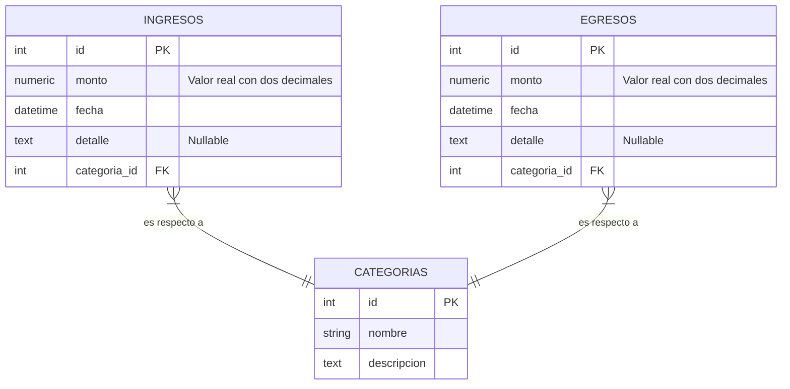

# Diagrama Entidad-Relacion

```mermaid
erDiagram
	CATEGORIAS{
		int id PK
		string nombre
		text descripcion
	}
	
	INGRESOS{
		int id PK
		numeric monto "Valor real con dos decimales"
		datetime fecha 
		text detalle "Nullable"
		int categoria_id FK
	}
	
	EGRESOS{
		int id PK
		numeric monto "Valor real con dos decimales"
		datetime fecha 
		text detalle "Nullable"
		int categoria_id FK
	}
	
INGRESOS }|--|| CATEGORIAS : "es respecto a"
EGRESOS }|--|| CATEGORIAS : "es respecto a"
```