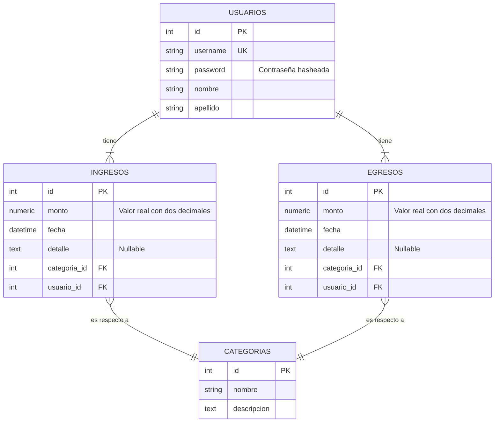

# Diagrama Entidad-Relacion

```mermaid
erDiagram
	CATEGORIAS{
		int id PK
		string nombre
		text descripcion
	}
	
	INGRESOS{
		int id PK
		numeric monto "Valor real con dos decimales"
		datetime fecha 
		text detalle "Nullable"
		int categoria_id FK
		int usuario_id FK
	}
	
	EGRESOS{
		int id PK
		numeric monto "Valor real con dos decimales"
		datetime fecha 
		text detalle "Nullable"
		int categoria_id FK
		int usuario_id FK
	}
	
	USUARIOS{
		int id PK
		string username UK
		string password "Contraseña hasheada"
		string nombre
		string apellido
	}
	
INGRESOS }|--|| CATEGORIAS : "es respecto a"
EGRESOS }|--|| CATEGORIAS : "es respecto a"
USUARIOS ||--|{ INGRESOS : "tiene"
USUARIOS ||--|{ EGRESOS : "tiene"
```